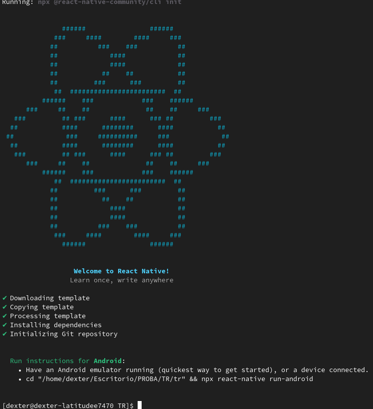
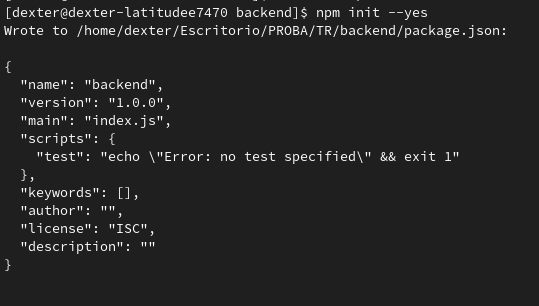

 
## Create new project react-native

2. install npm
2. install : npm install -g react-native-cli && npm install -g react-native (admin or sudo)
3. react-native init MyProject

4. cd Myproject
5. react-native run-ios or run-android

## Create backend with socket.io 
1. create folder backend: mkdir backend
2. cd backend 
3. npm init --yes (load package.json)

 npm install -g expo-cli@latest

